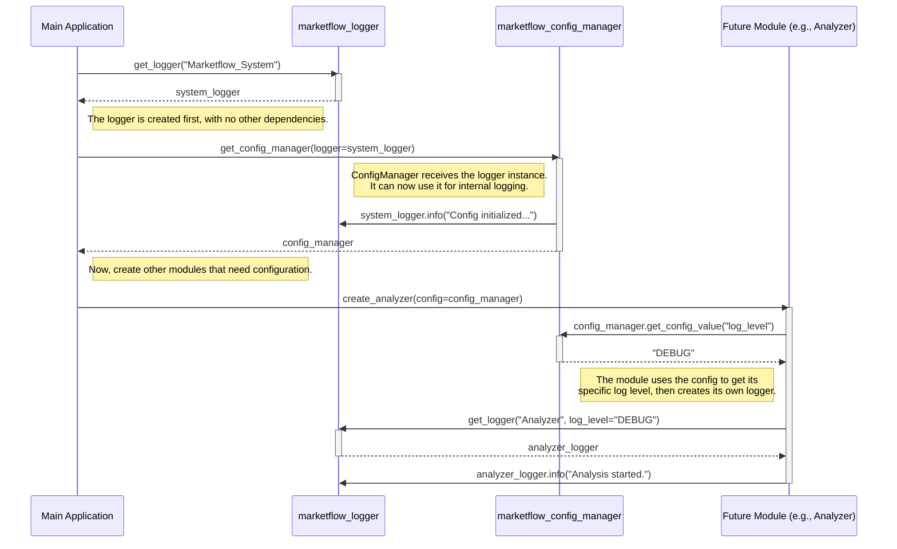

# MarketFlow

## 📋 Revision Control Table

| Date       | Revision | Modules/Scripts Affected                        |
|------------|----------|------------------------------------------------|
| 2025-07-04 | v1.2     | `marketflow_polygon_tolls.py` (new module)      |
| 2025-07-03 | v1.1     | `marketflow_config_manager.py`, `marketflow_logger.py` (refactor) |
| 2025-07-03 | v1.1     | `marketflow_utils.py` (new module)              |
| 2025-07-03 | v1.1     | `marketflow_data_provider.py` (async utility)   |
| 2025-07-01 | v1.0     | Initial release: all core modules              |

**MarketFlow** is a modular, extensible Python framework for advanced Volume-Price Analysis (VPA) and Wyckoff Method analytics. It integrates robust data collection, processing, and AI-driven narrative synthesis for modern stock market analysis. MarketFlow is designed for clarity, testability, and ease of extension.

---

## 🚀 Features

- **Modular architecture:** Clean separation of data fetching, processing, signal analysis, and LLM-driven reporting.
- **Provider-agnostic data layer:** Easily add new data providers (e.g., Polygon.io, Yahoo Finance).
- **LLM integration:** Swappable support for OpenAI, Ollama, and other LLMs for natural language reporting, tool-calling, and concept explanations.
- **Robust error handling:** Retries, logging, and detailed diagnostics for every module.
- **Configurable and secure:** Environment-based config, `.env` secrets, and a central `config_manager.py`.
- **Extensible:** Add new strategies, signals, or analytics with minimal friction.

---

## 📁 Folder Structure

```bash
marketflow/
│
├── __pycache__ 
│
├── __pytest_cache__ 
│
│
├── markdown_files/
│   ├── marketflow_files_compatibility_analysis.md (✓ created)
│   ├── marketflow_replacement_backup_guide.md (✓ created)
│   ├── post_replacement_verification_checklist.md (✓ created)
│
│       
│
├── marketflow/                                         # Core Python package
│   ├── __init__.py
│   ├── marketflow_config_manager.py (✓ replaced)       # Central config/env loader
│   ├── marketflow_data_provider.py                     # Abstract + provider-specific data fetchers
│   ├── marketflow_processor.py                         # Data processing/cleaning
│   ├── marketflow_analyzer.py                          # Core VPA and Wyckoff analytics
│   ├── marketflow_signals.py                           # Signal detection algorithms
│   ├── marketflow_wyc_module.py                        # Wyckoff method analytics
│   ├── marketflow_facade.py                            # Orchestrator: unified API for analytics, charting, reporting
│   ├── marketflow_logger.py (✓ replaced)               # Centralized logging
│   ├── marketflow_llm_providers.py                     # LLM abstraction layer
│   ├── marketflow_memory_manager.py                    # Conversation/session memory for LLMs
│   ├── marketflow_llm_interface.py                     # Human-friendly narrative/report generator for LLM
│   ├── marketflow_llm_query_engine.py                  # Orchestrates user query through LLM and backend
│   ├── marketflow_utils.py (✓ new)                     # This module contains common, reusable functions that are shared across different
│   ├── examples/
│   │    └── integration_example.py (✓ new)             # Integration example script
│   ├──
│   └── ...                                             # (Other modules as needed)
│
├── scripts/                                            # CLI, app entrypoints, notebooks, demos
│   └── marketflow_app.py                               # empty
│
├── tests/                                              # Unit and integration tests
│   ├── test_data_provider.py
│   ├── test_marketflow_modules.py (✓ new)
│   └── demo_marketflow_modules.py (✓ new)
│
├── deprecated_backup/
│   ├── backup_info.txt (✓ created)
│   └── modules/
│       ├── marketflow_config_manager_original.py (✓ backup)
│       └── marketflow_logger_original.py (✓ backup)
│
├── env                                                 # (Not committed) Environment 
├── .env                                                # (Not committed) Your API keys and secrets
├── .gitignore                                          # Standard ignore file
├── LICENSE                                             # MIT license
├── requirements.txt                                    # Python dependencies
├── README.md                                           # This file
├── backup_and_replace.bat (✓ created)
│  
│
├── .marketflow/
│   ├── config                                          # Config Files
│   ├── logs                                            # Central config/env loader
│   ├── memory                                          # Abstract + provider-specific data fetchers
│
│
├── marketflow_finetuning/                              # NEW: The home for all training activities
    │
    ├── 1_data_generation/
    │   ├── get_ticker_list.py                          # Script to fetch a diverse list of tickers
    │   └── generate_dataset.py                         # Main script to run your VPA and Wyckoff data engine and create raw data
    │
    ├── 2_datasets/
    │   ├── raw/                                        # Raw JSON outputs from your engine
    │   │   ├── aapl_2023-01-15.json
    │   │   └── ...
    │   ├── formatted/                                  # Data formatted for fine-tuning
    │   │   ├── training_data.jsonl
    │   │   └── validation_data.jsonl
    │   └── golden_test_set.jsonl                       # A hold-out set for final model evaluation
    │
    ├── 3_training/
    │   ├── configs/                                    # Training configuration files (e.g., for Axolotl)
    │   │   └── llama3_marketflow_tune.yml
    │   ├── train.py                                    # Script to launch the fine-tuning job (e.g., using OpenAI SDK or Hugging Face)
    │   └── notebooks/                                  # Jupyter notebooks for experimentation
    │       └── 01_explore_data.ipynb
    │
    ├── 4_evaluation/
    │   ├── evaluate_model.py                           # Script to compare model outputs against the golden_test_set
    │   └── results/                                    # Stored evaluation results
    │       └── llama3_marketflow_v1_results.json
    │
    ├── 5_models/                                       # Directory to store model checkpoints (for open-source models)
    │   └── llama3-8b-marketflow-v1/
    │
    └── management_ui.py                                # NEW: A Streamlit/Gradio app for managing the whole process

```

## Config Manager and Logger relationship support model



## ⚡ Quickstart

1. **Clone the repo and set up a virtual environment:**

    ```bash
    git clone https://github.com/Martinolli/marketflow.git
    cd marketflow
    python -m venv .venv
    source .venv/bin/activate  # or .venv\Scripts\activate
    pip install -r requirements.txt
    ```

2. **Set up your `.env` file with API keys:**

    ```bash
    cp .env.example .env  # or create .env manually
    # Edit .env and add your API keys, e.g.:
    # POLYGON_API_KEY=your_polygon_api_key
    # OPENAI_API_KEY=your_openai_api_key
    # OLLAMA_BASE_URL=http://localhost:11434
    ```

3. **Run the CLI app:**

    ```bash
    python scripts/marketflow_app.py --query "Analyze AAPL"
    ```

---

## 🛠️ Configuration

All configuration is managed by `config_manager.py` and environment variables.

- Do **not** commit your `.env` file.
- Use the `ConfigManager` class to access API keys and config in code.

---

## 📊 Extending MarketFlow

- **New data provider?**  
  Subclass `BaseDataProvider` in `data_provider.py`, and register it in the factory.
- **New signal or analytics?**  
  Add logic to `marketflow_signals.py` or `marketflow_analyzer.py`.
- **Custom reporting/LLM tools?**  
  Update `marketflow_llm_interface.py` and `llm_providers.py`.
- **Testing:**  
  Add new tests to the `tests/` folder using mocks for API calls.

---

## 📝 License

MIT License

---

## 🤝 Contributing

Contributions welcome!  
Please open issues or pull requests to suggest improvements.

---

## 📚 Documentation

- Each module is documented with clear docstrings.
- See the code comments and CLI help for usage examples.

---

*MarketFlow: Modular, modern analytics for the modern market.*
