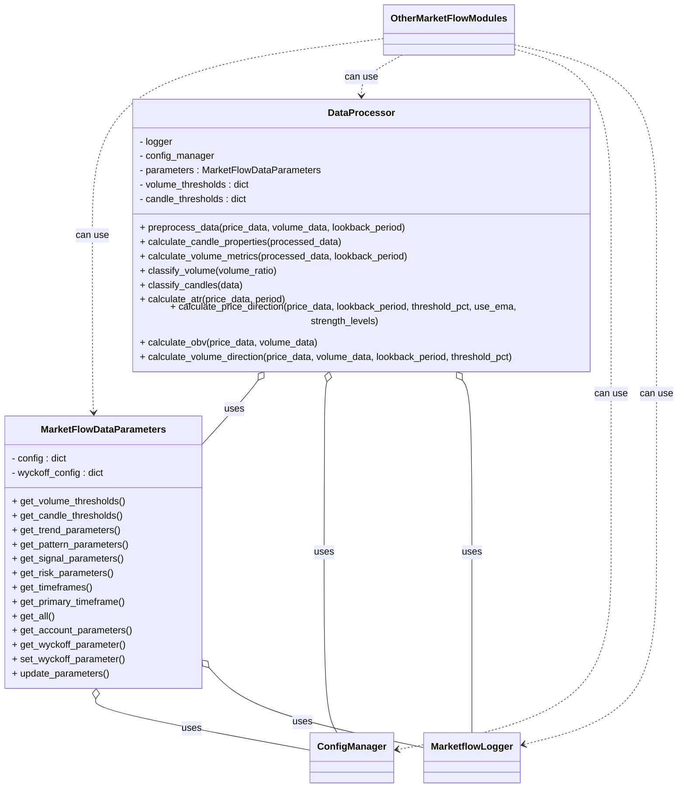
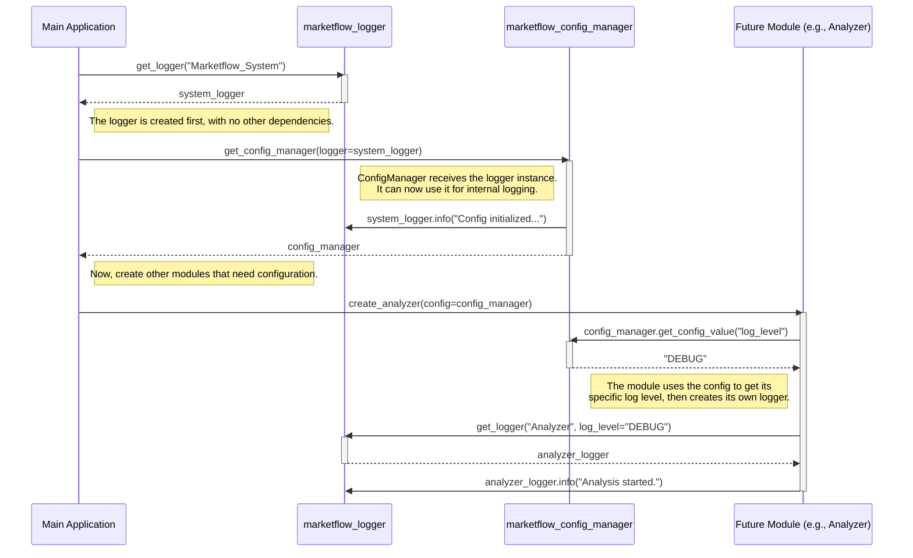

# MarketFlow

## 📋 Revision Control Table

| Date       | Revision | Modules/Scripts Affected                        |
|------------|----------|------------------------------------------------|
| 2025-07-11 | v1.8     | `marketflow_facade.py` (new module)             |
| 2025-07-10 | v1.7     | `candle_analyzer.py` (new module)              |
| 2025-07-10 | v1.7     | `trend_analyzer.py` (new module)               |
| 2025-07-10 | v1.7     | `pattern_recognizer.py` (new module)           |
| 2025-07-10 | v1.7     | `support_resistance_analyzer.py` (new module)  |
| 2025-07-10 | v1.7     | `multi_timeframe_analyzer.py` (new module)     |
| 2025-07-10 | v1.7     | `point_in_time_analyzer.py` (new module)       |
| 2025-07-09 | v1.6     | `marketflow_analyzer` (refactor - split the file into different modules)               |
| 2025-07-09 | v1.6     | `candle_analyzer.py` (new module)              |
| 2025-07-09 | v1.6     | `trend_analyzer.py` (new module)               |
| 2025-07-09 | v1.6     | `pattern_recognizer.py` (new module)           |
| 2025-07-09 | v1.6     | `support_resistance_analyzer.py` (new module)  |
| 2025-07-09 | v1.6     | `multi_timeframe_analyzer.py` (new module)     |
| 2025-07-09 | v1.6     | `point_in_time_analyzer.py` (new module)       |
| 2025-07-06 | v1.5     | `marketflow_analyzer` (new module)             |
| 2025-07-06 | v1.4     | `enums.py` (new module)                        |
| 2025-07-05 | v1.3     | `marketflow_wyckoff.py` (new module)           |
| 2025-07-05 | v1.3     | `marketflow_signals.py` (new module)           |
| 2025-07-05 | v1.3     | `marketflow_processor.py` (new module)          |
| 2025-07-05 | v1.3     | `marketflow_data_parameters.py` (new module)    |
| 2025-07-04 | v1.2     | `marketflow_polygon_tolls.py` (new module)      |
| 2025-07-03 | v1.1     | `marketflow_config_manager.py`, `marketflow_logger.py` (refactor) |
| 2025-07-03 | v1.1     | `marketflow_utils.py` (new module)              |
| 2025-07-03 | v1.1     | `marketflow_data_provider.py` (async utility)   |
| 2025-07-01 | v1.0     | Initial release: all core modules              |

**MarketFlow** is a modular, extensible Python framework for advanced Volume-Price Analysis (VPA) and Wyckoff Method analytics. It integrates robust data collection, processing, and AI-driven narrative synthesis for modern stock market analysis. MarketFlow is designed for clarity, testability, and ease of extension.

---



## 🚀 Features

- **Modular architecture:** Clean separation of data fetching, processing, signal analysis, and LLM-driven reporting.
- **Provider-agnostic data layer:** Easily add new data providers (e.g., Polygon.io, Yahoo Finance).
- **LLM integration:** Swappable support for OpenAI, Ollama, and other LLMs for natural language reporting, tool-calling, and concept explanations.
- **Robust error handling:** Retries, logging, and detailed diagnostics for every module.
- **Configurable and secure:** Environment-based config, `.env` secrets, and a central `config_manager.py`.
- **Extensible:** Add new strategies, signals, or analytics with minimal friction.

---

## 📁 Folder Structure

```bash
marketflow/
│
├── __pycache__ 
│
├── .marketflow/
│   ├── config                                          # Config Files
│   ├── logs                                            # Central config/env loader
│   ├── memory                                          # Abstract + provider-specific data fetchers
|
├── .pytest_cache
|
|
├── .vscode/
│
├── deprecated_backup/
│   ├── backup_info.txt (✓ created)
│   └── modules/
│       ├── marketflow_config_manager_original.py (✓ backup)
│       └── marketflow_logger_original.py (✓ backup)
│
├── env                                                 # (Not committed) Environment
|
├── markdown_files/
│   ├── marketflow_files_compatibility_analysis.md (✓ created)
│   ├── marketflow_replacement_backup_guide.md (✓ created)
│   ├── post_replacement_verification_checklist.md (✓ created)
│   ├── marketflow_analyzer_changes.md (✓ created)
│
│       
│
├── marketflow/                                         # Core Python package
│   ├── __pycache__
│   ├── examples/
│   │    └── integration_example.py (✓ new)             # Integration example script
│   ├── __init__.py
│   ├── candle_analyzer.py  (✓ new)                     # Enum definitions
│   ├── enums.py                                        # Enum definitions
│   ├── marketflow_analyzer.py  (✓ new)                 # Core VPA and Wyckoff analytics
│   ├── marketflow_config_manager.py (✓ replaced)       # Central config/env loader
│   ├── marketflow_data_parameters.py (✓ new)           # This module contains the data parameters to be used by processor
│   ├── marketflow_data_provider.py (✓ replaced)        # Abstract + provider-specific data fetchers
│   ├── marketflow_facade.py  (✓ new)                   # Orchestrator: unified API for analytics, charting, reporting
│   ├── marketflow_logger.py (✓ replaced)               # Centralized logging
│   ├── marketflow_memory_manager.py (TBD)              # Conversation/session memory for LLMs
│   ├── marketflow_polygon_tools.py (new)               # Polygon Tools Requesting Code
│   ├── marketflow_processor.py  (✓ new)                # Data processing/cleaning
│   ├── marketflow_signals.py   (✓ new)                 # Signal detection algorithms
│   ├── marketflow_utils.py (✓ new)                     # This module contains common, reusable functions that are shared across different
│   ├── marketflow_wyckoff.py (✓ new)                   # Wyckoff method analytics
│   ├── multi_timeframe_analyzer.py (✓ new)             # Multi timeframe analytics
│   ├── pattern_recognizer.py (✓ new)                   # Pattern recognition algorithms
│   ├── point_in_time_analyzer.py (✓ new)               # Point in time analytics
│   ├── support_resistance_analyzer.py (✓ new)          # Support and Resistance algorithms
│   ├── trend_analyzer.py (✓ new)                       # Trend Analyzer algorithms
│   ├── marketflow_llm_providers.py (TBD)               # LLM abstraction layer
│   ├── marketflow_llm_interface.py  (TBD)              # Human-friendly narrative/report generator for LLM
│   ├── marketflow_llm_query_engine.py (TBD)            # Orchestrates user query through LLM and backend
│   ├──
│   └── ...                                             # (Other modules as needed)
│
├── scripts/                                            # CLI, app entrypoints, notebooks, demos
│   └── marketflow_app.py                               # empty
│
├── tests/                                              # Unit and integration tests
│   ├── __pycache__                                     
│   ├── demo_marketflow_modules.py (✓ new)
│   ├── test_candle_analyzer_real_data.py (✓ new)
│   ├── test_data_provider_async.py (✓ new)
│   ├── test_data_provider_simple.py (✓ new)
│   ├── test_data_provider.py
│   ├── test_marketflow_data_parameters.py (✓ new)
│   ├── test_marketflow_modules.py (✓ new)
│   ├── test_marketflow_processor_integration.py (✓ new)
│   ├── test_multi_timeframe_analyzer_real_data.py (✓ new)
│   ├── test_pattern_recognizer_real_data.py (✓ new)
│   ├── test_point_in_time_analyzer_real_data.py (✓ new)
│   ├── test_signals.py (✓ new)
│   ├── test_support_and_resistance_real_data.py (✓ new)
│   ├── test_trend_analyzer_real_data.py (✓ new)
│   ├── test_wyckoff_phases.py (✓ new)
│   ├── test_wyckoff_real_data.py
│   ├── test_wyckoff.py (✓ new)
│   └── ...
│
│
├── .env                                                # (Not committed) Your API keys and secrets
├── .gitignore                                          # Standard ignore file
├── LICENSE                                             # MIT license
├── requirements.txt                                    # Python dependencies
├── README.md                                           # This file
├── backup_and_replace.bat (✓ created)
├── setup.py (✓ created)
│  
│
│
├── marketflow_finetuning/                              # NEW: The home for all training activities
    │
    ├── 1_data_generation/
    │   ├── get_ticker_list.py                          # Script to fetch a diverse list of tickers
    │   └── generate_dataset.py                         # Main script to run your VPA and Wyckoff data engine and create raw data
    │
    ├── 2_datasets/
    │   ├── raw/                                        # Raw JSON outputs from your engine
    │   │   ├── aapl_2023-01-15.json
    │   │   └── ...
    │   ├── formatted/                                  # Data formatted for fine-tuning
    │   │   ├── training_data.jsonl
    │   │   └── validation_data.jsonl
    │   └── golden_test_set.jsonl                       # A hold-out set for final model evaluation
    │
    ├── 3_training/
    │   ├── configs/                                    # Training configuration files (e.g., for Axolotl)
    │   │   └── llama3_marketflow_tune.yml
    │   ├── train.py                                    # Script to launch the fine-tuning job (e.g., using OpenAI SDK or Hugging Face)
    │   └── notebooks/                                  # Jupyter notebooks for experimentation
    │       └── 01_explore_data.ipynb
    │
    ├── 4_evaluation/
    │   ├── evaluate_model.py                           # Script to compare model outputs against the golden_test_set
    │   └── results/                                    # Stored evaluation results
    │       └── llama3_marketflow_v1_results.json
    │
    ├── 5_models/                                       # Directory to store model checkpoints (for open-source models)
    │   └── llama3-8b-marketflow-v1/
    │
    └── management_ui.py                                # NEW: A Streamlit/Gradio app for managing the whole process

```

## Config Manager and Logger relationship support model



## ⚡ Quickstart

1. **Clone the repo and set up a virtual environment:**

    ```bash
    git clone https://github.com/Martinolli/marketflow.git
    cd marketflow
    python -m venv .venv
    source .venv/bin/activate  # or .venv\Scripts\activate
    pip install -r requirements.txt
    ```

2. **Set up your `.env` file with API keys:**

    ```bash
    cp .env.example .env  # or create .env manually
    # Edit .env and add your API keys, e.g.:
    # POLYGON_API_KEY=your_polygon_api_key
    # OPENAI_API_KEY=your_openai_api_key
    # OLLAMA_BASE_URL=http://localhost:11434
    ```

3. **Run the CLI app:**

    ```bash
    python scripts/marketflow_app.py --query "Analyze AAPL"
    ```

---

## 📦 Module Overview

### marketflow_data_provider.py

The `marketflow_data_provider.py` module is the core data access layer for MarketFlow. It provides a robust, extensible interface for fetching price and volume data from external sources, such as Polygon.io. Key features include:

- **Abstract Base Class (`DataProvider`)**  
  Defines a standard interface for all data providers, requiring both synchronous (`get_data`) and asynchronous (`get_data_async`) methods for fetching price and volume data.

- **PolygonIOProvider**  
  Implements the data provider interface for Polygon.io, with:
  - Advanced error handling and retry logic (including exponential backoff and jitter)
  - Support for both synchronous and asynchronous data fetching
  - API key management and configuration integration
  - Interval and period parsing, and conversion of raw API responses into pandas DataFrames and Series

- **MultiTimeframeProvider**  
  Utility class for fetching data across multiple timeframes (e.g., daily, hourly) in a single call, supporting both sync and async workflows.

- **Error Handling**  
  Categorizes errors (network, API, authentication, rate limit, data processing, unknown), applies retries, and logs all issues for diagnostics.

- **Extensibility**  
  New data providers can be added easily by subclassing `DataProvider`.

This module is the foundation for all data ingestion in MarketFlow, ensuring reliability, testability, and future extensibility.

## 🛠️ Configuration

All configuration is managed by `config_manager.py` and environment variables.

- Do **not** commit your `.env` file.
- Use the `ConfigManager` class to access API keys and config in code.

---

## ⚙️ Configuration Manager Module (`marketflow_config_manager.py`)

The **Configuration Manager** is the central hub for all configuration, API key management, and system settings in MarketFlow. This module provides a robust, secure, and cross-platform solution for managing application configuration with multiple fallback mechanisms and comprehensive validation.

### 🎯 Key Features

#### **🔐 Secure API Key Management**

- **Multi-source support**: Environment variables, JSON config files, or programmatic setting
- **Service-specific validation**: Built-in validation for different API key formats (OpenAI, Polygon.io)
- **Safe retrieval**: Non-throwing methods for optional API keys
- **Centralized storage**: Single point of configuration for all external services

#### **🤖 LLM Provider Configuration**

- **Multi-provider support**: OpenAI, Ollama, and extensible architecture for additional providers
- **Model management**: Configure and switch between different LLM models (including fine-tuned models)
- **Provider-specific settings**: Separate configuration for API keys, base URLs, and model names
- **Runtime switching**: Change LLM providers and models without restart

#### **🌐 Cross-Platform Compatibility**

- **Path handling**: Uses `pathlib.Path` for Windows/Linux/macOS compatibility
- **Environment detection**: Automatic project root detection and relative path resolution
- **Fallback mechanisms**: Multiple configuration file locations with intelligent fallbacks
- **Directory creation**: Automatic creation of required directories for logs and memory storage

#### **📝 Comprehensive Configuration Sources**

The Configuration Manager checks for settings in this priority order:

1. **Environment Variables** (highest priority)

   ```bash
   MARKETFLOW_LLM_PROVIDER=openai
   MARKETFLOW_LOG_LEVEL=DEBUG
   OPENAI_API_KEY=sk-your-key-here
   POLYGON_API_KEY=your-polygon-key
   ```

2. **JSON Configuration Files** (multiple locations checked)
   - User-specified config file path
   - `{project_root}/.marketflow/config/config.json`
   - `{user_home}/.marketflow/config.json`
   - `{current_directory}/marketflow_config.json`
   - `{module_directory}/config.json`

3. **Programmatic Settings** (via `set_config_value()`)

4. **Built-in Defaults** (lowest priority)

### 🏗️ Architecture & Design Patterns

#### **Dependency Injection for Logger**

```python
# Avoids circular imports by accepting logger as dependency
config = ConfigManager(logger=your_logger)
```

#### **Singleton Pattern Support**

```python
# Get shared instance across the application
config = get_config_manager()
```

#### **Backward Compatibility**

```python
# Legacy interface still supported
legacy_config = MARKETFLOWConfigManager()
```

### 📋 Configuration Parameters

#### **LLM Provider Settings**

| Parameter | Environment Variable | Default | Description |
|-----------|---------------------|---------|-------------|
| `llm_provider` | `LLM_PROVIDER` | `"openai"` | LLM provider (openai/ollama) |
| `openai_api_key` | `OPENAI_API_KEY` | `None` | OpenAI API key |
| `openai_model_name` | `OPENAI_MODEL_NAME` | `"gpt-4-turbo-preview"` | OpenAI model |
| `ollama_base_url` | `OLLAMA_BASE_URL` | `"http://localhost:11434"` | Ollama server URL |
| `ollama_model_name` | `OLLAMA_MODEL_NAME` | `"llama3:instruct"` | Ollama model |

#### **Data Provider Settings**

| Parameter | Environment Variable | Default | Description |
|-----------|---------------------|---------|-------------|
| `polygon_api_key` | `POLYGON_API_KEY` | `None` | Polygon.io API key |

#### **Application Settings**

| Parameter | Environment Variable | Default | Description |
|-----------|---------------------|---------|-------------|
| `log_level` | `LOG_LEVEL` | `"INFO"` | Logging level |
| `max_conversation_history` | `MAX_CONVERSATION_HISTORY` | `10` | Chat history limit |
| `rag_top_k` | `RAG_TOP_K` | `5` | RAG retrieval limit |
| `log_file_path` | `LOG_FILE_PATH` | `{project}/.marketflow/logs/marketflow_engine.log` | Log file location |
| `memory_db_path` | `MEMORY_DB_PATH` | `{project}/.marketflow/memory/marketflow_chat_history.db` | Memory database |

### 🔧 Usage Examples

#### **Basic Configuration Setup**

```python
from marketflow.marketflow_config_manager import get_config_manager

# Initialize with logger
config = get_config_manager(logger=my_logger)

# Get API keys safely
openai_key = config.get_api_key_safe('openai')
polygon_key = config.get_api_key('polygon')  # Raises error if not found

# Get LLM configuration
llm_config = config.get_llm_provider_config()
current_model = config.get_llm_model()
```

#### **Runtime Configuration Changes**

```python
# Change LLM model
config.set_llm_model('gpt-4')

# Set API keys programmatically
config.set_api_key('openai', 'sk-new-key')

# Update any configuration value
config.set_config_value('log_level', 'DEBUG')

# Save configuration to file
config.save_config()
```

#### **Configuration Validation**

```python
# Validate all configuration
validation_results = config.validate_configuration()
print(f"OpenAI API Key Valid: {validation_results['openai_api_key']}")
print(f"LLM Provider Config Valid: {validation_results['llm_provider_config']}")

# Validate specific API key
is_valid = config.validate_api_key('polygon')
```

### 🔧 Advanced Features

#### **Fine-tuned Model Support**

```python
# Set custom fine-tuned model
config.set_llm_model('ft:gpt-3.5-turbo:marketflow:20250602')

# List available models
available_models = config.get_available_models()
```

#### **Cross-platform File Paths**

```python
# Automatically handles Windows/Linux/macOS paths
log_path = config.LOG_FILE_PATH  # Always uses correct path separators
memory_path = config.MEMORY_DB_PATH  # Directories created automatically
```

#### **Environment-specific Configuration**

```python
# Development environment
config.set_config_value('log_level', 'DEBUG')

# Production environment  
config.set_config_value('log_level', 'WARNING')
```

### 🛡️ Security & Best Practices

#### **API Key Security**

- Never hardcode API keys in source code
- Use environment variables for production
- Store sensitive config files outside the repository
- Use the `get_api_key_safe()` method for optional keys

#### **Configuration File Security**

```json
// .marketflow/config/config.json (example - keep secure)
{
    "llm_provider": "openai",
    "openai_model_name": "gpt-4-turbo-preview",
    "log_level": "INFO",
    "max_conversation_history": 20,
    "rag_top_k": 10
}
```

#### **Environment Variable Setup**

```bash
# .env file (never commit this file)
OPENAI_API_KEY=sk-your-openai-key-here
POLYGON_API_KEY=your-polygon-api-key
MARKETFLOW_LLM_PROVIDER=openai
MARKETFLOW_LOG_LEVEL=INFO
```

### 🔄 Integration with Other Modules

The Configuration Manager integrates seamlessly with all MarketFlow modules:

- **Logger**: Provides log levels and file paths
- **Data Provider**: Supplies API keys and provider settings  
- **LLM Interface**: Configures provider, models, and parameters
- **Memory Manager**: Specifies database paths and conversation limits
- **Facade**: Central configuration access point

### 🧪 Testing & Validation

```python
# Test configuration without external dependencies
config = ConfigManager(logger=test_logger)

# Mock API keys for testing
config.set_api_key('openai', 'test-key')
config.set_api_key('polygon', 'test-key')

# Validate test configuration
results = config.validate_configuration()
assert all(results.values()), "Configuration validation failed"
```

### 🔄 Migration & Backward Compatibility

The module maintains full backward compatibility with the original `MARKETFLOWConfigManager` interface while providing enhanced functionality. Legacy code continues to work without modification:

```python
# Legacy interface (still supported)
from marketflow.marketflow_config_manager import MARKETFLOWConfigManager
legacy_config = MARKETFLOWConfigManager()

# Modern interface (recommended)
from marketflow.marketflow_config_manager import get_config_manager
modern_config = get_config_manager()
```

---

## 📊 Extending MarketFlow

- **New data provider?**  
  Subclass `BaseDataProvider` in `data_provider.py`, and register it in the factory.
- **New signal or analytics?**  
  Add logic to `marketflow_signals.py` or `marketflow_analyzer.py`.
- **Custom reporting/LLM tools?**  
  Update `marketflow_llm_interface.py` and `llm_providers.py`.
- **Testing:**  
  Add new tests to the `tests/` folder using mocks for API calls.

---

## 📝 License

MIT License

---

## 🤝 Contributing

Contributions welcome!  
Please open issues or pull requests to suggest improvements.

---

## 📚 Documentation

- Each module is documented with clear docstrings.
- See the code comments and CLI help for usage examples.

---

*MarketFlow: Modular, modern analytics for the modern market.*
