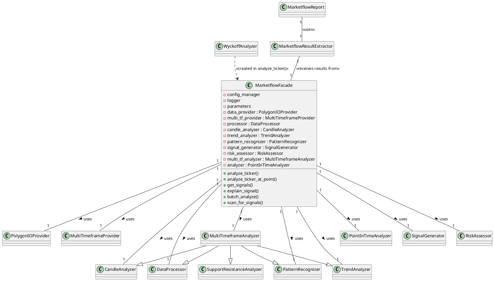
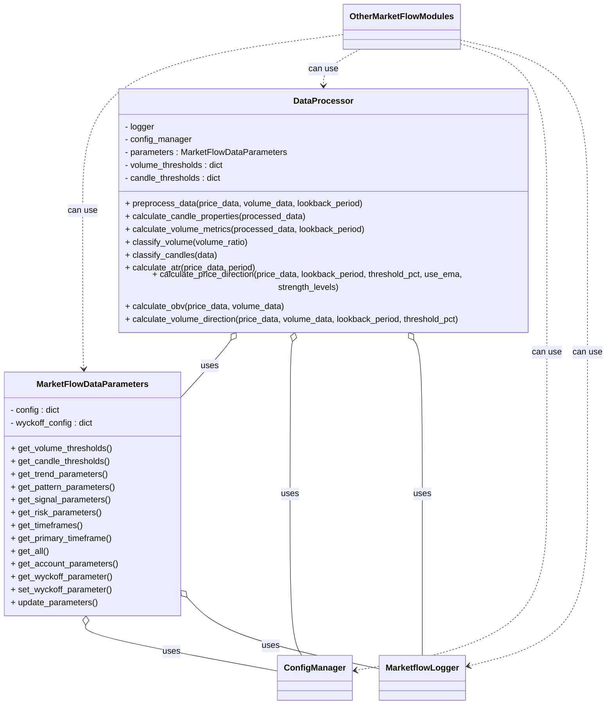
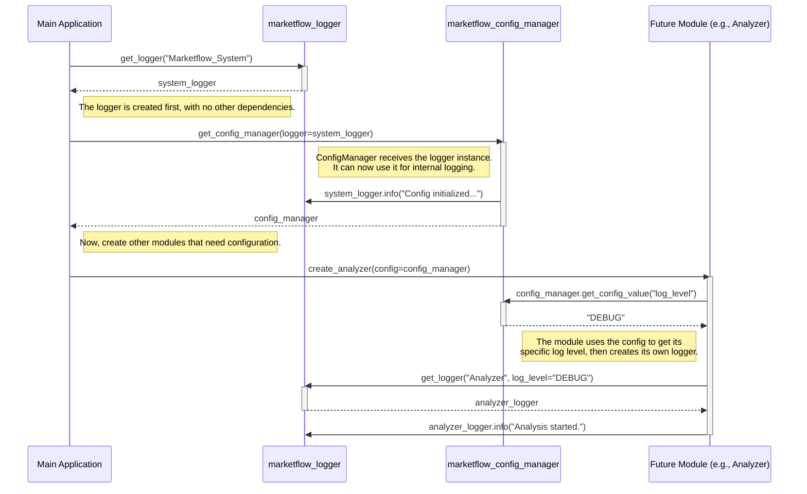

# MarketFlow

## 📋 Revision Control Table

| Date       | Revision | Modules/Scripts Affected                        |
|------------|----------|------------------------------------------------|
| 2025-07-15 | v1.12    | `embedder_vector_db.py` (new module)           |
| 2025-07-12 | v1.11    | `chunker.py`, `embedder.py`, `retriever.py` (new module) |
| 2025-07-12 | v1.11    | `marketflow_report.py` (new module)             |
| 2025-07-12 | v1.10    | `marketflow_result_extractor.py` (new module)  |
| 2025-07-12 | v1.9     | `marketflow_analyzer.py` (deprecated)             |
| 2025-07-11 | v1.8     | `marketflow_facade.py` (new module)             |
| 2025-07-10 | v1.7     | `candle_analyzer.py` (new module)              |
| 2025-07-10 | v1.7     | `trend_analyzer.py` (new module)               |
| 2025-07-10 | v1.7     | `pattern_recognizer.py` (new module)           |
| 2025-07-10 | v1.7     | `support_resistance_analyzer.py` (new module)  |
| 2025-07-10 | v1.7     | `multi_timeframe_analyzer.py` (new module)     |
| 2025-07-10 | v1.7     | `point_in_time_analyzer.py` (new module)       |
| 2025-07-09 | v1.6     | `marketflow_analyzer` (refactor - split the file into different modules)               |
| 2025-07-09 | v1.6     | `candle_analyzer.py` (new module)              |
| 2025-07-09 | v1.6     | `trend_analyzer.py` (new module)               |
| 2025-07-09 | v1.6     | `pattern_recognizer.py` (new module)           |
| 2025-07-09 | v1.6     | `support_resistance_analyzer.py` (new module)  |
| 2025-07-09 | v1.6     | `multi_timeframe_analyzer.py` (new module)     |
| 2025-07-09 | v1.6     | `point_in_time_analyzer.py` (new module)       |
| 2025-07-06 | v1.5     | `marketflow_analyzer` (new module)             |
| 2025-07-06 | v1.4     | `enums.py` (new module)                        |
| 2025-07-05 | v1.3     | `marketflow_wyckoff.py` (new module)           |
| 2025-07-05 | v1.3     | `marketflow_signals.py` (new module)           |
| 2025-07-05 | v1.3     | `marketflow_processor.py` (new module)          |
| 2025-07-05 | v1.3     | `marketflow_data_parameters.py` (new module)    |
| 2025-07-04 | v1.2     | `marketflow_polygon_tolls.py` (new module)      |
| 2025-07-03 | v1.1     | `marketflow_config_manager.py`, `marketflow_logger.py` (refactor) |
| 2025-07-03 | v1.1     | `marketflow_utils.py` (new module)              |
| 2025-07-03 | v1.1     | `marketflow_data_provider.py` (async utility)   |
| 2025-07-01 | v1.0     | Initial release: all core modules              |

**MarketFlow** is a modular, extensible Python framework for advanced Volume-Price Analysis (VPA) and Wyckoff Method analytics. It integrates robust data collection, processing, and AI-driven narrative synthesis for modern stock market analysis. MarketFlow is designed for clarity, testability, and ease of extension.

---

## MarketFlow Project Description

## 1. Overview: Main Data Flow in MarketFlow

The MarketFlow system is organized around the facade pattern (via MarketflowFacade), which orchestrates a modular pipeline for multi-timeframe financial analysis. The main pathway is:

External Input (ticker, timeframes) → Data Acquisition → Preprocessing → Multi-Timeframe Analysis → Signal Generation → Risk Assessment (+Wyckoff/Pattern analysis)

## 2. Module-by-Module Data Pathway

Below is a breakdown of the data flow and dependencies, referencing your modules:

### 1. Entry Point: MarketflowFacade

Input: ticker, timeframes
Delegates to:
MultiTimeframeProvider → Data acquisition (price/volume for all timeframes)
MultiTimeframeAnalyzer → Feature extraction & Analysis per timeframe

### 2. Data Acquisition

Module: marketflow_data_provider.py
PolygonIOProvider.get_data() fetches raw OHLCV data as (price_df, volume_series)
MultiTimeframeProvider.get_multi_timeframe_data() fetches for all configured timeframes, returns timeframe_data dict.

### 3. Preprocessing

Module: marketflow_processor.py
DataProcessor.preprocess_data()
Aligns price and volume
Calculates candle properties, volume metrics, trend/volume direction
Outputs: processed_data (dict of derived features, e.g. price, volume, candle_class, etc.)

### 4. Multi-Timeframe Analysis

Module: multi_timeframe_analyzer.py
For each timeframe:
CandleAnalyzer.analyze_candle()
TrendAnalyzer.analyze_trend()
PatternRecognizer.identify_patterns()
SupportResistanceAnalyzer.analyze_support_resistance()
Outputs: timeframe_analyses (per-tf dict of candle_analysis, trend_analysis, etc.)

### 5. Signal Generation & Risk Assessment

Module: marketflow_signals.py
SignalGenerator.generate_signals()
Consumes timeframe_analyses and confirmation dict.
Returns a unified signal dict.
RiskAssessor.assess_trade_risk()
Consumes signal, current_price, and S/R levels.
Returns position sizing and risk metrics.

### 6. Wyckoff/Pattern Analysis (Advanced)

Module: marketflow_wyckoff.py
Consumes processed_data
Returns detected Wyckoff phases, events, trading ranges, added to the analysis output.

## 3. Text-Based Data Flow Diagram

```bash
User Request (ticker, timeframes)
    |
    v
MarketflowFacade.analyze_ticker()
    |
    v
+--------------------+
| MultiTimeframeProvider.get_multi_timeframe_data()         |  ---> [Per timeframe: raw price/volume]
+--------------------+
    |
    v
+--------------------+
| DataProcessor.preprocess_data()         |  ---> [processed_data: price, volume, candle_class, etc.]
+--------------------+
    |
    v
+--------------------+
| MultiTimeframeAnalyzer.analyze_multiple_timeframes()      |
|   ├─ CandleAnalyzer.analyze_candle()                     |
|   ├─ TrendAnalyzer.analyze_trend()                       |
|   ├─ PatternRecognizer.identify_patterns()               |
|   └─ SupportResistanceAnalyzer.analyze_support_resistance() |
+--------------------+
    |
    v
+--------------------+
| SignalGenerator.generate_signals()      |  ---> [signal dict]
| RiskAssessor.assess_trade_risk()        |  ---> [risk assessment]
+--------------------+
    |
    v
+--------------------+
| WyckoffAnalyzer.run_analysis()           |  ---> [phases, events, trading_ranges]
+--------------------+
    |
    v
Final Output (analysis dict with all above results)
```

## 4. Key Data Structures at Each Step

* Raw Data:

    price_df: OHLC DataFrame
    volume_series: Pandas Series

* Processed Data:

    Dict with keys: price, volume, spread, candle_class, volume_class, etc.

* Timeframe Analysis Result:

    Dict with keys: candle_analysis, trend_analysis, pattern_analysis, support_resistance, processed_data

* Signal:

    Dict: type, strength, details, evidence

* Risk Assessment:

    Dict: stop_loss, take_profit, risk_reward_ratio, position_size, etc.

* Wyckoff Output:

    Lists of detected phases, events, trading_ranges

## 5. Suggestions for Improving Clarity

Add Inline Logging/Debug Output:
Each module already logs key steps—ensure these logs include data shapes, keys, and sample values for easier tracing.

Document Data Schema:
Consider a markdown file or docstring in each module with the expected input/output format.

Explicit Type Hints:
Use type hints in function signatures for clarity, e.g., def analyze_candle(self, idx: int, processed_data: dict) -> dict:

Trace IDs:
Optionally, add a unique trace/session ID through the pipeline for correlating logs.

## 6. Next Steps

Use the above diagram as a base.
For each step, you can expand the diagram to show which fields are produced/consumed.
If you want a more visual (ASCII art) version, let me know!

## 1. Expanded Data Flow Diagram: Produced and Consumed Fields

This diagram shows, for each step/module, the primary fields produced (outputs) and consumed (inputs). The list is based on your codebase and the typical structure of data as it flows through the pipeline.

```plantuml
@startuml

' MarketFlow Core Data Flow and Class Diagram
User Request (ticker, timeframes)
    |
    v
MarketflowFacade.analyze_ticker()
    |
    V   (Consumes: ticker, timeframes)
+--------------------+
| MultiTimeframeProvider.get_multi_timeframe_data()         |  
|   - Consumes: ticker, timeframes (interval, period, dates)|
|   - Produces:                                          |
|       {                                                |
|         "1d": { "price_data", "volume_data" },         |
|         "1h": { "price_data", "volume_data" }, ...     |
|       }                                                |
+--------------------+
    |
    v
+--------------------+
| DataProcessor.preprocess_data()                         |
|   - Consumes: price_data, volume_data (per timeframe)   |
|   - Produces (per tf):                                 |
|       processed_data: {                                |
|         "price", "volume", "spread", "body_percent",   |
|         "upper_wick", "lower_wick", "avg_volume",      |
|         "volume_ratio", "volume_class",                |
|         "candle_class", "price_direction",             |
|         "volume_direction"                             |
|       }                                                |
+--------------------+
    |
    v
+--------------------+
| MultiTimeframeAnalyzer.analyze_multiple_timeframes()    |
|   - Consumes: processed_data (per tf)                  |
|   - Produces (per tf):                                 |
|       {                                                |
|         "candle_analysis":                             |
|             consumes: candle_class, volume_class,      |
|                      price_direction, price            |
|             produces: signal_type, signal_strength,    |
|                       details, ...                    |
|         "trend_analysis":                              |
|             consumes: price, volume, volume_class      |
|             produces: trend_direction,                 |
|                       signal_type, signal_strength,    |
|                       details, ...                    |
|         "pattern_analysis":                            |
|             consumes: price, volume, volume_class      |
|             produces: e.g., {accumulation, ...}        |
|         "support_resistance":                          |
|             consumes: price, volume                    |
|             produces: {support, resistance, ...}       |
|         "processed_data": { ... }                      |
|       }                                                |
+--------------------+
    |
    v
+--------------------+
| SignalGenerator.generate_signals()                     |
|   - Consumes: timeframe_analyses, confirmations        |
|   - Produces: signal dict:                             |
|         { type, strength, details, evidence }          |
+--------------------+
| RiskAssessor.assess_trade_risk()                       |
|   - Consumes: signal, current_price, support_resistance|
|   - Produces: { stop_loss, take_profit,                |
|                 risk_reward_ratio, position_size, ... }|
+--------------------+
    |
    v
+--------------------+
| WyckoffAnalyzer.run_analysis()                         |
|   - Consumes: processed_data (per tf)                  |
|   - Produces: { phases, events, trading_ranges }       |
+--------------------+
    |
    v
Final Output (dict):
{
    "ticker": ...,
    "timeframe_analyses": { ... },
    "confirmations": ...,
    "signal": ...,
    "risk_assessment": ...,
    "current_price": ...,
    "wyckoff_phases": ...,
    "wyckoff_events": ...,
    "wyckoff_trading_ranges": ...,
}
@enduml
```

## 2. UML Diagram: MarketFlow Core Classes (Conceptual)

This UML class diagram shows the primary classes, their key methods, and relationships. The focus is on data flow and module dependencies, not every method or field.

```bash
+---------------------------------------------------------------+
|                        MarketflowFacade                       |
+---------------------------------------------------------------+
| - parameters: MarketFlowDataParameters                        |
| - data_provider: PolygonIOProvider                            |
| - multi_tf_provider: MultiTimeframeProvider                   |
| - multi_tf_analyzer: MultiTimeframeAnalyzer                   |
| - signal_generator: SignalGenerator                           |
| - risk_assessor: RiskAssessor                                 |
| - processor: DataProcessor                                    |
| - analyzer: PointInTimeAnalyzer                               |
+---------------------------------------------------------------+
| + analyze_ticker(ticker, timeframes) : dict                   |
| + analyze_ticker_at_point(ticker, data_by_tf): dict           |
| + get_signals(ticker, timeframes): dict                       |
| + explain_signal(ticker, timeframes): str                     |
+---------------------------------------------------------------+
                |         (uses)
                v
+-------------------------------+
| MultiTimeframeProvider        |-----------+
+-------------------------------+           |
| + get_multi_timeframe_data()  |           |
| + get_multi_timeframe_data_async()        |
+-------------------------------+           |
    |        (uses)                         |
    v                                       |
+-------------------------------+           |
| PolygonIOProvider             |           |
+-------------------------------+           |
| + get_data()                  |           |
| + get_data_async()            |           |
+-------------------------------+           |
                                            |
+-------------------------------+           |
| MultiTimeframeAnalyzer        |<----------+
+-------------------------------+
| + analyze_multiple_timeframes()|
| + identify_timeframe_confirmations()|
+-------------------------------+
    |        (uses)      
    v
+----------------+     +-------------------+    +----------------+
| CandleAnalyzer |     | TrendAnalyzer     |    | PatternRecognizer |
+----------------+     +-------------------+    +----------------+
| + analyze_candle()|  | + analyze_trend() |    | + identify_patterns() |
+----------------+     +-------------------+    +----------------+
    |                                       
    v                                       
+-----------------------------+             
| SupportResistanceAnalyzer   |             
+-----------------------------+             
| + analyze_support_resistance()|
+-----------------------------+

+-----------------------+      +------------------+
| SignalGenerator       |      | RiskAssessor     |
+-----------------------+      +------------------+
| + generate_signals()  |      | + assess_trade_risk() |
+-----------------------+      +------------------+

+---------------------+
| WyckoffAnalyzer     |
+---------------------+
| + run_analysis()    |
| + detect_events()   |
| + detect_phases()   |
+---------------------+

(Arrows: solid for composition/aggregation, dashed for use/call)
```

Notes:
    - Most modules depend on a shared MarketFlowDataParameters for configuration.
    - Data flows linearly through the pipeline, but results are bundled per timeframe.
    - The facade orchestrates the entire pipeline, calling each module in sequence.
    - The WyckoffAnalyzer operates on processed data per timeframe, after the main analysis.

How to Read This Diagram
Produced fields: Each module’s main output fields are listed under "produces" in the data flow diagram.
Consumed fields: Each module’s main input fields are listed under "consumes".
UML: Shows class relationships (not full attributes/methods for brevity) and how data flows via method calls.

```plantuml
@startuml
' MarketFlow Core Data Flow and Class Diagram

skinparam classAttributeIconSize 0
skinparam shadowing false

' === Core Classes ===
class MarketflowFacade {
    +analyze_ticker(ticker, timeframes): dict
    +analyze_ticker_at_point(ticker, data_by_tf): dict
    +get_signals(ticker, timeframes): dict
    +explain_signal(ticker, timeframes): str
}

class PolygonIOProvider {
    +get_data(ticker, interval, period, start, end): (price_df, volume_series)
}

class MultiTimeframeProvider {
    +get_multi_timeframe_data(ticker, timeframes): dict
}

class DataProcessor {
    +preprocess_data(price_data, volume_data): dict
    -- Produces: --
    spread
    body_percent
    upper_wick
    lower_wick
    avg_volume
    volume_ratio
    volume_class
    candle_class
    price_direction
    volume_direction
}

class MultiTimeframeAnalyzer {
    +analyze_multiple_timeframes(timeframe_data): dict
    ' Consumes: processed_data (from DataProcessor)
    ' Produces: 
    '  candle_analysis, trend_analysis, pattern_analysis, support_resistance, processed_data
}

class CandleAnalyzer {
    +analyze_candle(idx, processed_data): dict
    -- Consumes: candle_class, volume_class, price_direction, price
    -- Produces: signal_type, signal_strength, details
}

class TrendAnalyzer {
    +analyze_trend(processed_data, idx): dict
    -- Consumes: price, volume, volume_class
    -- Produces: trend_direction, price_change_percent, volume_trend, signal_type, signal_strength, details
}

class PatternRecognizer {
    +identify_patterns(processed_data, idx): dict
    -- Consumes: price, volume, volume_class
    -- Produces: accumulation, distribution, testing, buying_climax, selling_climax
}

class SupportResistanceAnalyzer {
    +analyze_support_resistance(processed_data): dict
    -- Consumes: price, volume
    -- Produces: support, resistance, volume_at_levels
}

class SignalGenerator {
    +generate_signals(timeframe_analyses, confirmations): dict
    -- Consumes: all tf analyses & confirmations
    -- Produces: signal dict (type, strength, details, evidence)
}

class RiskAssessor {
    +assess_trade_risk(signal, current_price, support_resistance): dict
    -- Consumes: signal, current_price, support_resistance
    -- Produces: stop_loss, take_profit, risk_reward_ratio, position_size, risk_per_share
}

class WyckoffAnalyzer {
    +run_analysis(): (phases, events, trading_ranges)
    -- Consumes: processed_data
    -- Produces: wyckoff_phases, wyckoff_events, wyckoff_trading_ranges
}

' === Data/Method Flow (Dependencies) ===
MarketflowFacade --> MultiTimeframeProvider : get_multi_timeframe_data
MultiTimeframeProvider --> PolygonIOProvider : get_data

MarketflowFacade --> MultiTimeframeAnalyzer : analyze_multiple_timeframes
MultiTimeframeAnalyzer --> DataProcessor : preprocess_data
MultiTimeframeAnalyzer --> CandleAnalyzer : analyze_candle
MultiTimeframeAnalyzer --> TrendAnalyzer : analyze_trend
MultiTimeframeAnalyzer --> PatternRecognizer : identify_patterns
MultiTimeframeAnalyzer --> SupportResistanceAnalyzer : analyze_support_resistance

MarketflowFacade --> SignalGenerator : generate_signals
MarketflowFacade --> RiskAssessor : assess_trade_risk
MarketflowFacade --> WyckoffAnalyzer : run_analysis

' === Data/Field Flow Notes ===
note right of DataProcessor
    Output fields:
      - spread
      - body_percent
      - upper_wick/lower_wick
      - avg_volume, volume_ratio
      - volume_class, candle_class
      - price_direction, volume_direction
end note

note "Consumes processed_data fields (candle_class, volume_class, price_direction, price)" as C1
CandleAnalyzer .. C1

note "Consumes price, volume, volume_class" as T1
TrendAnalyzer .. T1

note "Consumes price, volume, volume_class" as P1
PatternRecognizer .. P1

note "Consumes price, volume" as S1
SupportResistanceAnalyzer .. S1

note "Consumes all tf analyses & confirmations" as SIG1
SignalGenerator .. SIG1

note "Consumes signal, current_price, support_resistance" as RISK1
RiskAssessor .. RISK1

note "Consumes processed_data" as W1
WyckoffAnalyzer .. W1

@enduml
```



## 🚀 Modules Description

| Module                    | Role                                                        |
| ------------------------- | ----------------------------------------------------------- |
| MarketflowFacade          | Orchestrates the entire analysis pipeline                   |
| PolygonIOProvider         | Fetches market data from external APIs                      |
| MultiTimeframeProvider    | Supports multi-timeframe data acquisition                   |
| DataProcessor             | Preprocesses and feature-engineers data                     |
| CandleAnalyzer            | Detects candlestick signals                                 |
| TrendAnalyzer             | Analyzes trend direction/strength                           |
| PatternRecognizer         | Finds market structure patterns (accumulation, tests, etc.) |
| SupportResistanceAnalyzer | Identifies support/resistance levels                        |
| WyckoffAnalyzer           | Detects Wyckoff phases, events, trading ranges              |
| MultiTimeframeAnalyzer    | Aggregates multi-timeframe results                          |
| SignalGenerator           | Synthesizes actionable signals                              |
| RiskAssessor              | Computes stops, targets, position size                      |
| MarketflowResultExtractor | Structures results for reporting                            |
| MarketflowReport          | Generates TXT, HTML, JSON reports                           |

## PlantUML Class Diagram Preview





## 🚀 Features

**Modular architecture:** Clean separation of data fetching, processing, signal analysis, and LLM-driven reporting.
**Provider-agnostic data layer:** Easily add new data providers (e.g., Polygon.io, Yahoo Finance).
**LLM integration:** Swappable support for OpenAI, Ollama, and other LLMs for natural language reporting, tool-calling, and concept explanations.
**Robust error handling:** Retries, logging, and detailed diagnostics for every module.
**Configurable and secure:** Environment-based config, `.env` secrets, and a central `config_manager.py`.
**Extensible:** Add new strategies, signals, or analytics with minimal friction.

---

## 📁 Folder Structure

```bash
marketflow/
│
├── __pycache__ 
│
├── .marketflow/
│   ├── config                                          # Config Files
│   ├── logs                                            # Central config/env loader
│   ├── memory                                          # Abstract + provider-specific data fetchers
│   └── reports                                         # Save Reports
|
├── .pytest_cache
|
|
├── .vscode/
│
├── deprecated_backup/
│   ├── backup_info.txt (✓ created)
│   └── modules/
│       ├── marketflow_config_manager_original.py (✓ backup)
│       ├── marketflow_logger_original.py (✓ backup)
│       └── marketflow_analyzer.py  (✓ backup)                 
│
├── env                                                 # (Not committed) Environment
|
├── knowledgebase/                                      # KNowledge Datase      
│   ├── chunked/ (✓ created)                            # Chunked Files
│   ├── embeddings (✓ created)                          # Embeddings Files
│   ├── sources (✓ created)                             # Sources Files
│   └── vectordb (✓ created)                            # Embeddings DB file
│
│       
├── markdown_files/
│   ├── marketflow_files_compatibility_analysis.md (✓ created)
│   ├── marketflow_replacement_backup_guide.md (✓ created)
│   ├── post_replacement_verification_checklist.md (✓ created)
│   └── marketflow_analyzer_changes.md (✓ created)
│
│       
│
├── marketflow/                                         # Core Python package
│   ├── __pycache__
│   ├── examples/
│   │    └── integration_example.py (✓ new)             # Integration example script
│   ├── __init__.py
│   ├── candle_analyzer.py  (✓ new)                     # Enum definitions
│   ├── enums.py                                        # Enum definitions
│   ├── marketflow_config_manager.py (✓ replaced)       # Central config/env loader
│   ├── marketflow_data_parameters.py (✓ new)           # This module contains the data parameters to be used by processor
│   ├── marketflow_data_provider.py (✓ replaced)        # Abstract + provider-specific data fetchers
│   ├── marketflow_facade.py  (✓ new)                   # Orchestrator: unified API for analytics, charting, reporting
│   ├── marketflow_logger.py (✓ replaced)               # Centralized logging
│   ├── marketflow_memory_manager.py (TBD)              # Conversation/session memory for LLMs
│   ├── marketflow_polygon_tools.py (new)               # Polygon Tools Requesting Code
│   ├── marketflow_processor.py  (✓ new)                # Data processing/cleaning
│   ├── marketflow_report.py  (✓ new)                   # Report generation
│   ├── marketflow_result_extractor.py  (✓ new)         # Extractor Data from Facade
│   ├── marketflow_signals.py   (✓ new)                 # Signal detection algorithms
│   ├── marketflow_utils.py (✓ new)                     # This module contains common, reusable functions that are shared across different
│   ├── marketflow_wyckoff.py (✓ new)                   # Wyckoff method analytics
│   ├── multi_timeframe_analyzer.py (✓ new)             # Multi timeframe analytics
│   ├── pattern_recognizer.py (✓ new)                   # Pattern recognition algorithms
│   ├── point_in_time_analyzer.py (✓ new)               # Point in time analytics
│   ├── support_resistance_analyzer.py (✓ new)          # Support and Resistance algorithms
│   ├── trend_analyzer.py (✓ new)                       # Trend Analyzer algorithms
│   ├── marketflow_llm_providers.py (TBD)               # LLM abstraction layer
│   ├── marketflow_llm_interface.py  (TBD)              # Human-friendly narrative/report generator for LLM
│   ├── marketflow_llm_query_engine.py (TBD)            # Orchestrates user query through LLM and backend
│   ├──
│   └── ...                                             # (Other modules as needed)
│
├── rag/                                                # RAG scripts
│   ├── __init__.py
│   ├── chunker.py  (✓ new)                            # Chunker script
│   ├── embedder_vector_db.py  (✓ new)                 # Embedder DB script                                      
│   ├── embedder.py (✓ new)                            # Embedder script
│   └── retriever.py (✓ new)                           # Retriever scrip
│
├── scripts/                                            # CLI, app entrypoints, notebooks, demos
│   └── marketflow_app.py                               # empty
│
├── tests_outputs/                                      # Outputs Tests Files
│   └── tsts_files                                      # HTML, JSON, TXT files
│
├── tests/                                              # Unit and integration tests
│   ├── __pycache__                                     
│   ├── demo_marketflow_modules.py (✓ new)
│   ├── test_candle_analyzer_real_data.py (✓ new)
│   ├── test_data_provider_async.py (✓ new)
│   ├── test_data_provider_simple.py (✓ new)
│   ├── test_data_provider.py
│   ├── test_test_integration_core_pipeline.py (✓ new)
│   ├── test_marketflow_data_parameters.py (✓ new)
│   ├── test_marketflow_facade_real_data.py (✓ new)
│   ├── test_marketflow_modules.py (✓ new)
│   ├── test_marketflow_processor_integration.py (✓ new)
│   ├── test_multi_timeframe_analyzer_real_data.py (✓ new)
│   ├── test_pattern_recognizer_real_data.py (✓ new)
│   ├── test_point_in_time_analyzer_real_data.py (✓ new)
│   ├── test_signals.py (✓ new)
│   ├── test_support_and_resistance_real_data.py (✓ new)
│   ├── test_trend_analyzer_real_data.py (✓ new)
│   ├── test_wyckoff_phases.py (✓ new)
│   ├── test_wyckoff_real_data.py
│   ├── test_wyckoff.py (✓ new)
│   └── ...
│
│
├── .env                                                # (Not committed) Your API keys and secrets
├── .gitignore                                          # Standard ignore file
├── LICENSE                                             # MIT license
├── requirements.txt                                    # Python dependencies
├── README.md                                           # This file
├── backup_and_replace.bat (✓ created)
├── setup.py (✓ created)
│  
│
│
├── marketflow_finetuning/                              # NEW: The home for all training activities
    │
    ├── 1_data_generation/
    │   ├── get_ticker_list.py                          # Script to fetch a diverse list of tickers
    │   └── generate_dataset.py                         # Main script to run your VPA and Wyckoff data engine and create raw data
    │
    ├── 2_datasets/
    │   ├── raw/                                        # Raw JSON outputs from your engine
    │   │   ├── aapl_2023-01-15.json
    │   │   └── ...
    │   ├── formatted/                                  # Data formatted for fine-tuning
    │   │   ├── training_data.jsonl
    │   │   └── validation_data.jsonl
    │   └── golden_test_set.jsonl                       # A hold-out set for final model evaluation
    │
    ├── 3_training/
    │   ├── configs/                                    # Training configuration files (e.g., for Axolotl)
    │   │   └── llama3_marketflow_tune.yml
    │   ├── train.py                                    # Script to launch the fine-tuning job (e.g., using OpenAI SDK or Hugging Face)
    │   └── notebooks/                                  # Jupyter notebooks for experimentation
    │       └── 01_explore_data.ipynb
    │
    ├── 4_evaluation/
    │   ├── evaluate_model.py                           # Script to compare model outputs against the golden_test_set
    │   └── results/                                    # Stored evaluation results
    │       └── llama3_marketflow_v1_results.json
    │
    ├── 5_models/                                       # Directory to store model checkpoints (for open-source models)
    │   └── llama3-8b-marketflow-v1/
    │
    └── management_ui.py                                # NEW: A Streamlit/Gradio app for managing the whole process

```

## Config Manager and Logger relationship support model



## ⚡ Quickstart

1. **Clone the repo and set up a virtual environment:**

    ```bash
    git clone https://github.com/Martinolli/marketflow.git
    cd marketflow
    python -m venv .venv
    source .venv/bin/activate  # or .venv\Scripts\activate
    pip install -r requirements.txt
    ```

2. **Set up your `.env` file with API keys:**

    ```bash
    cp .env.example .env  # or create .env manually
    # Edit .env and add your API keys, e.g.:
    # POLYGON_API_KEY=your_polygon_api_key
    # OPENAI_API_KEY=your_openai_api_key
    # OLLAMA_BASE_URL=http://localhost:11434
    ```

3. **Run the CLI app:**

    ```bash
    python scripts/marketflow_app.py --query "Analyze AAPL"
    ```

---

## 📦 Module Overview

### marketflow_data_provider.py

The `marketflow_data_provider.py` module is the core data access layer for MarketFlow. It provides a robust, extensible interface for fetching price and volume data from external sources, such as Polygon.io. Key features include:

**Abstract Base Class (`DataProvider`)**  
  Defines a standard interface for all data providers, requiring both synchronous (`get_data`) and asynchronous (`get_data_async`) methods for fetching price and volume data.

**PolygonIOProvider**  
  Implements the data provider interface for Polygon.io, with:

  Advanced error handling and retry logic (including exponential backoff and jitter)
  Support for both synchronous and asynchronous data fetching
  API key management and configuration integration
  Interval and period parsing, and conversion of raw API responses into pandas DataFrames and Series

 **MultiTimeframeProvider**  
  Utility class for fetching data across multiple timeframes (e.g., daily, hourly) in a single call, supporting both sync and async workflows.

 **Error Handling**  
  Categorizes errors (network, API, authentication, rate limit, data processing, unknown), applies retries, and logs all issues for diagnostics.

 **Extensibility**  
  New data providers can be added easily by subclassing `DataProvider`.

This module is the foundation for all data ingestion in MarketFlow, ensuring reliability, testability, and future extensibility.

## 🛠️ Configuration

All configuration is managed by `config_manager.py` and environment variables.

 Do **not** commit your `.env` file.
Use the `ConfigManager` class to access API keys and config in code.

---

### marketflow_processor.py

**complete description** of marketflow_processor.py, including the **sequence of operations** and a **table summarizing the final processed data content**.

---

## Description of Processor Module (`marketflow_processor.py`)

This module defines the `DataProcessor` class, which processes raw price and volume data for the Marketflow algorithm. It performs data alignment, calculates technical features, classifies candles and volume, and determines price and volume trends.

### Sequence of Operations

1. **Initialization (`__init__`)**
   Sets up logging.
   Loads configuration and parameters (thresholds for volume and candles).

2. **Preprocessing (`preprocess_data`)**
   Accepts price (OHLC) and volume data.
   Aligns both datasets on their datetime index.
   Stores aligned data in a dictionary.
   Calculates candle properties (spread, body %, wicks).
   Calculates volume metrics (average volume, volume ratio).
   Classifies volume and candles using thresholds.
   Calculates price direction (trend) using ATR and price change.
   Calculates volume direction using On Balance Volume (OBV).

3. **Feature Calculation Methods**

   `calculate_candle_properties`: Computes spread, body %, upper/lower wicks.
   `calculate_volume_metrics`: Computes rolling average volume and volume ratio.
   `classify_volume`: Categorizes volume as VERY_HIGH, HIGH, AVERAGE, LOW, or VERY_LOW.
   `classify_candles`: Categorizes candles as WIDE, NARROW, WICK, or NEUTRAL.
   `calculate_atr`: Computes Average True Range for volatility.
   `calculate_price_direction`: Determines price trend (UP, DOWN, SIDEWAYS, with optional strength).
   `calculate_obv`: Computes On Balance Volume.
   `calculate_volume_direction`: Determines volume trend (INCREASING, DECREASING, FLAT).

---

## Final Processed Data Table

After running `preprocess_data`, the returned dictionary contains the following keys and their descriptions:

| Key               | Type           | Description                                                                 |
|-------------------|----------------|-----------------------------------------------------------------------------|
| `price`           | DataFrame      | Aligned OHLC price data                                                     |
| `volume`          | Series         | Aligned volume data                                                         |
| `spread`          | Series         | Absolute difference between close and open (candle body size)               |
| `body_percent`    | Series         | Ratio of body size to total candle range                                    |
| `upper_wick`      | Series         | Distance from candle top to body                                            |
| `lower_wick`      | Series         | Distance from candle bottom to body                                         |
| `avg_volume`      | Series         | Rolling average of volume over lookback period                              |
| `volume_ratio`    | Series         | Ratio of current volume to average volume                                   |
| `volume_class`    | Series         | Volume classification (VERY_HIGH, HIGH, AVERAGE, LOW, VERY_LOW)             |
| `candle_class`    | Series         | Candle classification (WIDE, NARROW, WICK, NEUTRAL)                         |
| `price_direction` | Series         | Price trend direction (UP, DOWN, SIDEWAYS, optionally with strength)         |
| `volume_direction`| Series         | Volume trend direction (INCREASING, DECREASING, FLAT)                       |

---

**Summary:**  
The `DataProcessor` class takes raw price and volume data, aligns and processes it, calculates technical features, classifies candles and volume, and outputs a dictionary with all relevant features for further analysis or modeling.

## ⚙️ Configuration Manager Module (`marketflow_config_manager.py`)

The **Configuration Manager** is the central hub for all configuration, API key management, and system settings in MarketFlow. This module provides a robust, secure, and cross-platform solution for managing application configuration with multiple fallback mechanisms and comprehensive validation.

## Marketflow Signals Description and Parameters Flow

### 📦 Marketflow Signals Module Description

This module provides signal generation and risk assessment for the Marketflow trading algorithm based on Volume Price Analysis (VPA). It consists of two main classes:

### 1. SignalGenerator Class

The `SignalGenerator` class is responsible for analyzing market data across multiple timeframes and generating trading signals based on VPA patterns, candle analysis, and trend analysis.

**Key Features:**

 Multi-timeframe analysis integration
 Pattern recognition (accumulation, distribution, climax patterns)
 Signal strength classification (Strong, Moderate, Neutral)
 Evidence gathering for signal validation

### 2. RiskAssessor Class

The `RiskAssessor` class calculates risk metrics for potential trades, including stop-loss levels, take-profit targets, position sizing, and risk-reward ratios.

**Key Features:**

 Dynamic stop-loss calculation based on support/resistance levels
 Take-profit level optimization
 Position sizing based on account risk parameters
 Risk-reward ratio analysis

## Data Flow

1. **Input**: Timeframe analyses and confirmations are fed into the `SignalGenerator`
2. **Signal Analysis**: The system checks for strong and moderate buy/sell signals across timeframes
3. **Pattern Recognition**: Identifies VPA patterns (accumulation, distribution, climax patterns)
4. **Signal Generation**: Creates a signal object with type, strength, and supporting evidence
5. **Risk Assessment**: The `RiskAssessor` calculates appropriate risk metrics for the generated signal
6. **Output**: Returns actionable trading signals with complete risk management parameters

## Detailed Method Information Table

| Class | Method | Input Parameters | Input Data Types | Output | Output Data Type | Description |
|-------|--------|------------------|------------------|---------|------------------|-------------|
| **SignalGenerator** | `__init__` | `data_parameters` (optional) | `MarketFlowDataParameters` or `None` | None | `None` | Initializes the signal generator with configuration parameters |
| **SignalGenerator** | `generate_signals` | `timeframe_analyses`: Dictionary with analysis results `confirmations`: Dictionary with confirmation analysis | `dict`, `dict` | Signal information dictionary | `dict[str, object]` | Main method that generates trading signals based on multi-timeframe VPA analysis |
| **SignalGenerator** | `is_strong_buy_signal` | `timeframe_analyses`: Analysis results per timeframe `confirmations`: Confirmation analysis | `dict`, `dict` | Boolean indicating strong buy signal presence | `bool` | Checks for strong bullish signals across timeframes with pattern confirmation |
| **SignalGenerator** | `is_strong_sell_signal` | `timeframe_analyses`: Analysis results per timeframe `confirmations`: Confirmation analysis | `dict`, `dict` | Boolean indicating strong sell signal presence | `bool` | Checks for strong bearish signals across timeframes with pattern confirmation |
| **SignalGenerator** | `is_moderate_buy_signal` | `timeframe_analyses`: Analysis results per timeframe `confirmations`: Confirmation analysis | `dict`, `dict` | Boolean indicating moderate buy signal presence | `bool` | Identifies moderate bullish signals with partial timeframe confirmation |
| **SignalGenerator** | `is_moderate_sell_signal` | `timeframe_analyses`: Analysis results per timeframe `confirmations`: Confirmation analysis | `dict`, `dict` | Boolean indicating moderate sell signal presence | `bool` | Identifies moderate bearish signals with partial timeframe confirmation |
| **SignalGenerator** | `gather_signal_evidence` | `timeframe_analyses`: Analysis results per timeframe `confirmations`: Confirmation analysis `signal_type`: Type of signal | `dict`, `dict`, `SignalType` | Supporting evidence dictionary | `dict` | Collects and organizes evidence supporting the generated signal |
| **RiskAssessor** | `__init__` | `data_parameters` (optional) | `MarketFlowDataParameters` or `None` | None | `None` | Initializes the risk assessor with risk and account parameters |
| **RiskAssessor** | `assess_trade_risk` | `signal`: Signal information `current_price`: Current asset price `support_resistance`: Support/resistance levels | `dict`, `float`, `dict` | Risk assessment dictionary | `dict` | Comprehensive risk assessment including stop-loss, take-profit, position size |
| **RiskAssessor** | `calculate_stop_loss` | `signal`: Signal information `current_price`: Current asset price `support_resistance`: Support/resistance levels | `dict`, `float`, `dict` | Stop loss price level | `float` | Calculates optimal stop-loss level based on support/resistance and signal type |
| **RiskAssessor** | `calculate_take_profit` | `signal`: Signal information `current_price`: Current asset price `support_resistance`: Support/resistance levels | `dict`, `float`, `dict` | Take profit price level | `float` | Calculates optimal take-profit level based on support/resistance and signal type |
| **RiskAssessor** | `calculate_position_size` | `current_price`: Current asset price `stop_loss`: Stop loss price level | `float`, `float` | Position size (number of shares) | `float` | Calculates appropriate position size based on account risk parameters |

### Key Data Structures

**Signal Dictionary Structure:**

```python
{
    "type": SignalType,           # BUY, SELL, or NO_ACTION
    "strength": SignalStrength,   # STRONG, MODERATE, or NEUTRAL
    "details": str,               # Human-readable description
    "evidence": dict              # Supporting evidence
}
```

**Risk Assessment Dictionary Structure:**

```python
{
    "stop_loss": float,           # Stop loss price level
    "take_profit": float,         # Take profit price level
    "risk_reward_ratio": float,   # Risk-to-reward ratio
    "position_size": float,       # Number of shares to trade
    "risk_per_share": float       # Risk amount per share
}
```

This module provides a complete trading signal generation and risk management system that integrates multiple timeframe analysis with robust risk assessment capabilities.

### 🎯 Key Features

#### **🔐 Secure API Key Management**

 **Multi-source support**: Environment variables, JSON config files, or programmatic setting
 **Service-specific validation**: Built-in validation for different API key formats (OpenAI, Polygon.io)
 **Safe retrieval**: Non-throwing methods for optional API keys
 **Centralized storage**: Single point of configuration for all external services

#### **🤖 LLM Provider Configuration**

 **Multi-provider support**: OpenAI, Ollama, and extensible architecture for additional providers
 **Model management**: Configure and switch between different LLM models (including fine-tuned models)
 **Provider-specific settings**: Separate configuration for API keys, base URLs, and model names
 **Runtime switching**: Change LLM providers and models without restart

#### **🌐 Cross-Platform Compatibility**

 **Path handling**: Uses `pathlib.Path` for Windows/Linux/macOS compatibility
 **Environment detection**: Automatic project root detection and relative path resolution
 **Fallback mechanisms**: Multiple configuration file locations with intelligent fallbacks
 **Directory creation**: Automatic creation of required directories for logs and memory storage

#### **📝 Comprehensive Configuration Sources**

The Configuration Manager checks for settings in this priority order:

1. **Environment Variables** (highest priority)

   ```bash
   MARKETFLOW_LLM_PROVIDER=openai
   MARKETFLOW_LOG_LEVEL=DEBUG
   OPENAI_API_KEY=sk-your-key-here
   POLYGON_API_KEY=your-polygon-key
   ```

2. **JSON Configuration Files** (multiple locations checked)
    User-specified config file path
    `{project_root}/.marketflow/config/config.json`
    `{user_home}/.marketflow/config.json`
    `{current_directory}/marketflow_config.json`
    `{module_directory}/config.json`

3. **Programmatic Settings** (via `set_config_value()`)

4. **Built-in Defaults** (lowest priority)

### 🏗️ Architecture & Design Patterns

#### **Dependency Injection for Logger**

```python
# Avoids circular imports by accepting logger as dependency
config = ConfigManager(logger=your_logger)
```

#### **Singleton Pattern Support**

```python
# Get shared instance across the application
config = get_config_manager()
```

#### **Backward Compatibility**

```python
# Legacy interface still supported
legacy_config = MARKETFLOWConfigManager()
```

### 📋 Configuration Parameters

#### **LLM Provider Settings**

| Parameter | Environment Variable | Default | Description |
|-----------|---------------------|---------|-------------|
| `llm_provider` | `LLM_PROVIDER` | `"openai"` | LLM provider (openai/ollama) |
| `openai_api_key` | `OPENAI_API_KEY` | `None` | OpenAI API key |
| `openai_model_name` | `OPENAI_MODEL_NAME` | `"gpt-4-turbo-preview"` | OpenAI model |
| `ollama_base_url` | `OLLAMA_BASE_URL` | `"http://localhost:11434"` | Ollama server URL |
| `ollama_model_name` | `OLLAMA_MODEL_NAME` | `"llama3:instruct"` | Ollama model |

#### **Data Provider Settings**

| Parameter | Environment Variable | Default | Description |
|-----------|---------------------|---------|-------------|
| `polygon_api_key` | `POLYGON_API_KEY` | `None` | Polygon.io API key |

#### **Application Settings**

| Parameter | Environment Variable | Default | Description |
|-----------|---------------------|---------|-------------|
| `log_level` | `LOG_LEVEL` | `"INFO"` | Logging level |
| `max_conversation_history` | `MAX_CONVERSATION_HISTORY` | `10` | Chat history limit |
| `rag_top_k` | `RAG_TOP_K` | `5` | RAG retrieval limit |
| `log_file_path` | `LOG_FILE_PATH` | `{project}/.marketflow/logs/marketflow_engine.log` | Log file location |
| `memory_db_path` | `MEMORY_DB_PATH` | `{project}/.marketflow/memory/marketflow_chat_history.db` | Memory database |

### 🔧 Usage Examples

#### **Basic Configuration Setup**

```python
from marketflow.marketflow_config_manager import get_config_manager

# Initialize with logger
config = get_config_manager(logger=my_logger)

# Get API keys safely
openai_key = config.get_api_key_safe('openai')
polygon_key = config.get_api_key('polygon')  # Raises error if not found

# Get LLM configuration
llm_config = config.get_llm_provider_config()
current_model = config.get_llm_model()
```

#### **Runtime Configuration Changes**

```python
# Change LLM model
config.set_llm_model('gpt-4')

# Set API keys programmatically
config.set_api_key('openai', 'sk-new-key')

# Update any configuration value
config.set_config_value('log_level', 'DEBUG')

# Save configuration to file
config.save_config()
```

#### **Configuration Validation**

```python
# Validate all configuration
validation_results = config.validate_configuration()
print(f"OpenAI API Key Valid: {validation_results['openai_api_key']}")
print(f"LLM Provider Config Valid: {validation_results['llm_provider_config']}")

# Validate specific API key
is_valid = config.validate_api_key('polygon')
```

### 🔧 Advanced Features

#### **Fine-tuned Model Support**

```python
# Set custom fine-tuned model
config.set_llm_model('ft:gpt-3.5-turbo:marketflow:20250602')

# List available models
available_models = config.get_available_models()
```

#### **Cross-platform File Paths**

```python
# Automatically handles Windows/Linux/macOS paths
log_path = config.LOG_FILE_PATH  # Always uses correct path separators
memory_path = config.MEMORY_DB_PATH  # Directories created automatically
```

#### **Environment-specific Configuration**

```python
# Development environment
config.set_config_value('log_level', 'DEBUG')

# Production environment  
config.set_config_value('log_level', 'WARNING')
```

### 🛡️ Security & Best Practices

#### **API Key Security**

 Never hardcode API keys in source code
 Use environment variables for production
 Store sensitive config files outside the repository
 Use the `get_api_key_safe()` method for optional keys

#### **Configuration File Security**

```json
// .marketflow/config/config.json (example - keep secure)
{
    "llm_provider": "openai",
    "openai_model_name": "gpt-4-turbo-preview",
    "log_level": "INFO",
    "max_conversation_history": 20,
    "rag_top_k": 10
}
```

#### **Environment Variable Setup**

```bash
# .env file (never commit this file)
OPENAI_API_KEY=sk-your-openai-key-here
POLYGON_API_KEY=your-polygon-api-key
MARKETFLOW_LLM_PROVIDER=openai
MARKETFLOW_LOG_LEVEL=INFO
```

### 🔄 Integration with Other Modules

The Configuration Manager integrates seamlessly with all MarketFlow modules:

 **Logger**: Provides log levels and file paths
 **Data Provider**: Supplies API keys and provider settings  
 **LLM Interface**: Configures provider, models, and parameters
 **Memory Manager**: Specifies database paths and conversation limits
 **Facade**: Central configuration access point

### 🧪 Testing & Validation

```python
# Test configuration without external dependencies
config = ConfigManager(logger=test_logger)

# Mock API keys for testing
config.set_api_key('openai', 'test-key')
config.set_api_key('polygon', 'test-key')

# Validate test configuration
results = config.validate_configuration()
assert all(results.values()), "Configuration validation failed"
```

### 🔄 Migration & Backward Compatibility

The module maintains full backward compatibility with the original `MARKETFLOWConfigManager` interface while providing enhanced functionality. Legacy code continues to work without modification:

```python
# Legacy interface (still supported)
from marketflow.marketflow_config_manager import MARKETFLOWConfigManager
legacy_config = MARKETFLOWConfigManager()

# Modern interface (recommended)
from marketflow.marketflow_config_manager import get_config_manager
modern_config = get_config_manager()
```

---

## 📊 Extending MarketFlow

 **New data provider?**  
 Subclass `BaseDataProvider` in `data_provider.py`, and register it in the factory.
 **New signal or analytics?**  
  Add logic to `marketflow_signals.py` or `marketflow_analyzer.py`.
 **Custom reporting/LLM tools?**  
 Update `marketflow_llm_interface.py` and `llm_providers.py`.
 **Testing:**  
  Add new tests to the `tests/` folder using mocks for API calls.

---

## 📝 License

MIT License

---

## 🤝 Contributing

Contributions welcome!  
Please open issues or pull requests to suggest improvements.

---

## 📚 Documentation

 Each module is documented with clear docstrings.
 See the code comments and CLI help for usage examples.

---

*MarketFlow: Modular, modern analytics for the modern market.*
